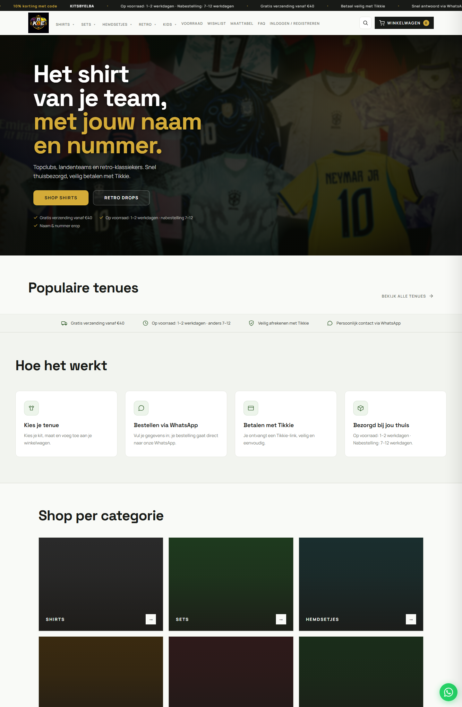
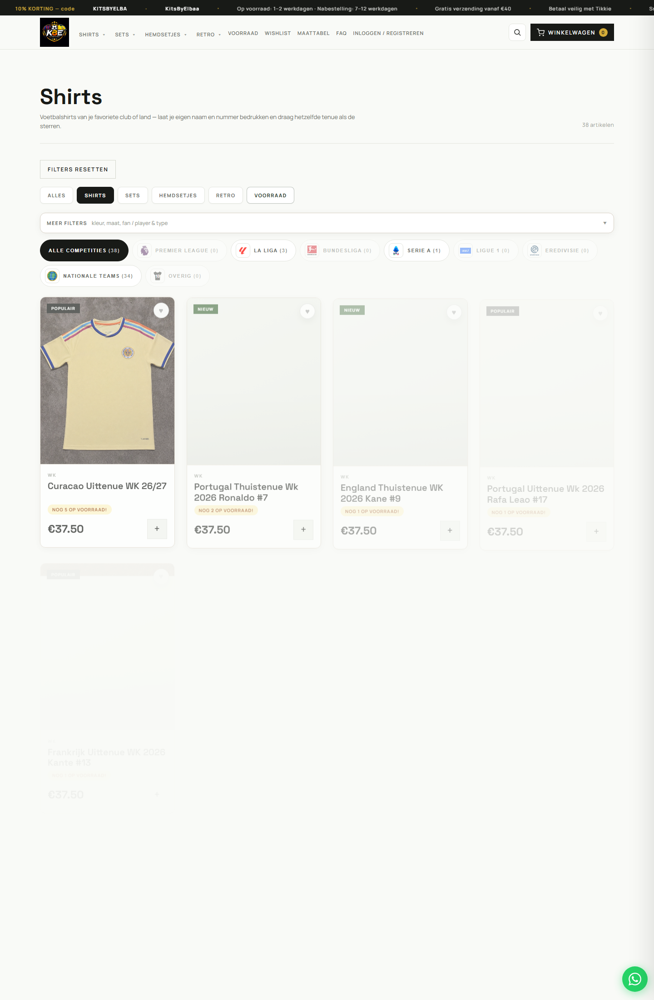

# Kits by Elba ⚽

Een complete webshop voor voetbalshirts, **volledig zelf gebouwd** in PHP en
vanilla JavaScript — van de productcatalogus en winkelwagen tot de betaal-flow,
het adminpaneel en de database. Geen framework, geen shop-plugin: alle logica,
security en architectuur zijn met de hand geschreven.


---

## 📸 Screenshots

| Homepage | Shop |
|----------|------|
|  |  |

---

## ✨ Functionaliteiten

**Winkel (klant)**
- Productcatalogus met categorieën (shirts, sets, retro, kids), competities en badges
- **Player- en fan-versie** per shirt, met een aparte prijs en voorraad per maat
- Winkelwagen, wishlist en een volledige **afreken-flow** met bestelbevestiging
- **Kortingscodes** die server-side gevalideerd worden
- **"Mail mij zodra weer op voorraad"** — voorraadnotificaties per product/maat
- Responsive design (mobiel-first) met losse iOS-optimalisaties

**Adminpaneel**
- Producten toevoegen en beheren, met afbeeldingen uploaden
- Voorraad per maat bijhouden voor zowel de fan- als de player-versie
- Bestellingen inzien met interne notities
- Kits-bibliotheek synchroniseren vanuit een mappenstructuur

## 🔒 Security & architectuur

Dit project is bewust gebouwd met productie-security in gedachten:

- **PDO met prepared statements** overal — geen ruimte voor SQL-injectie
- **CSRF-tokens** op de checkout en gevoelige acties
- **Rate limiting** op de API tegen misbruik
- **Admin-guard** die elke beheerdersroute afschermt
- **CORS** met een expliciete lijst van vertrouwde origins
- **Environment-based config** (`KITS_`-variabelen / `.env`) — geen wachtwoorden in de code
- **Idempotente auto-migraties**: het schema wordt bij het opstarten veilig aangevuld
- **App-logging** en een `healthz`-endpoint voor monitoring
- `declare(strict_types=1)` in alle PHP-bestanden

## 🛠️ Tech stack

| Laag | Gebruikt |
|------|----------|
| Back-end | PHP 8.3 (strict types), PDO |
| Database | MySQL / MariaDB |
| Front-end | Vanilla JavaScript, HTML5, CSS3 (responsive) |
| E-mail | EmailJS-integratie voor transactionele mails |

**Database:** `products`, `orders`, `order_items`, `coupons`, `users`,
`stock_notifications`, `site_settings`.

## ✅ Tests

De kritische reken- en validatielogica is losgetrokken in pure functies
(`includes/pricing.php`, `includes/auth_rules.php`, `includes/address_input_validate.php`)
en gedekt met unit-tests — zónder externe dependency, via een eigen kleine runner:

```bash
php tests/run.php
```

Gedekt: coupon-berekening (percent/vast, klemmen op 0–100% en op het subtotaal),
verzendkosten-drempel en eindtotaal, adresvalidatie (land-allowlist, huisnummer,
postcode, anti-XSS/spam), wachtwoordbeleid en e-mailnormalisatie, en de
HTTPS-detectie achter de Secure-cookievlag. De tests draaien ook in CI bij elke push.

## 🚀 Lokaal draaien

Vereist: PHP 8.3+ en MySQL/MariaDB (bijv. via XAMPP).

```bash
# 1. Zet de code in je webroot (bijv. C:/xampp/htdocs/kitsbyelba)
# 2. Maak een database 'kitsbyelba' aan
# 3. Kopieer de voorbeeld-config en vul je eigen waarden in
cp .env.example .env
```

Vul in `.env` minimaal in:

```
KITS_DB_HOST=127.0.0.1
KITS_DB_NAME=kitsbyelba
KITS_DB_USER=root
KITS_DB_PASS=
KITS_ADMIN_PASSWORD_HASH=   # genereer met password_hash()
KITS_PUBLIC_SITE_URL=http://localhost/kitsbyelba
```

Start daarna je server en open `http://localhost/kitsbyelba`. Het databaseschema
wordt bij de eerste API-aanroep automatisch aangevuld.

## 🗺️ Roadmap / mogelijke uitbreidingen

- Online betaling koppelen met **Mollie** (iDEAL/creditcard) — nu loopt afrekenen via WhatsApp + Tikkie
- Klant-accounts uitbreiden met bestelgeschiedenis
- Unit-tests uitbreiden richting end-to-end API-tests
- Bestellingen-export voor de administratie

---

_Gebouwd door Safouane Lahoua — software developer. Vragen of feedback? Open gerust een issue._
